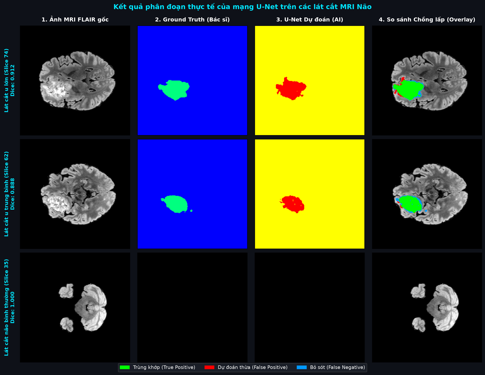
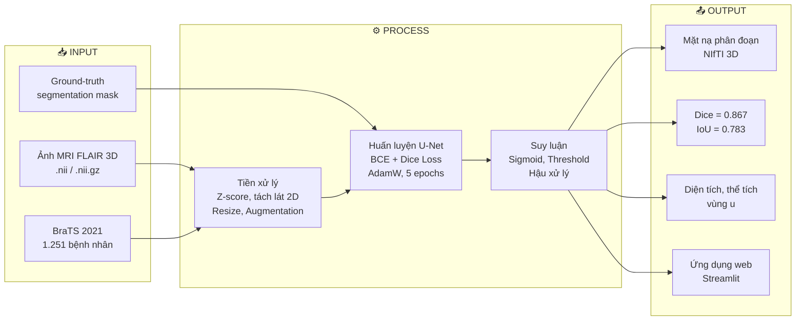
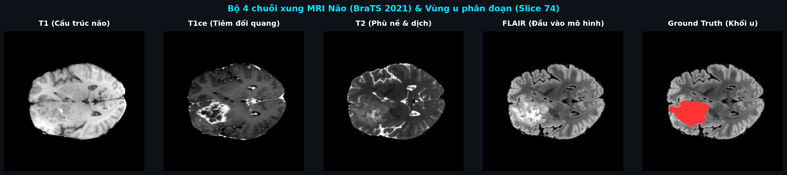
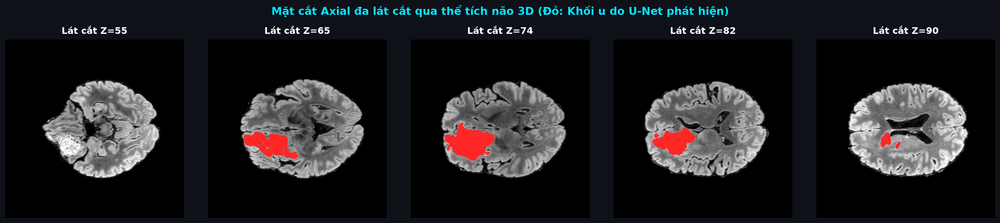
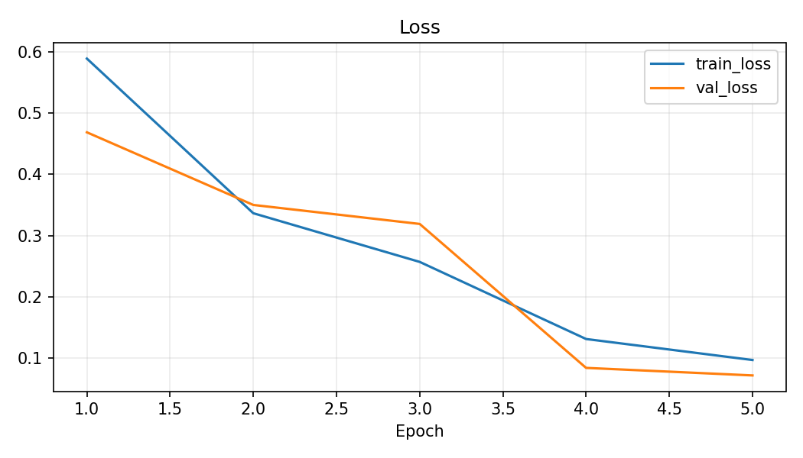
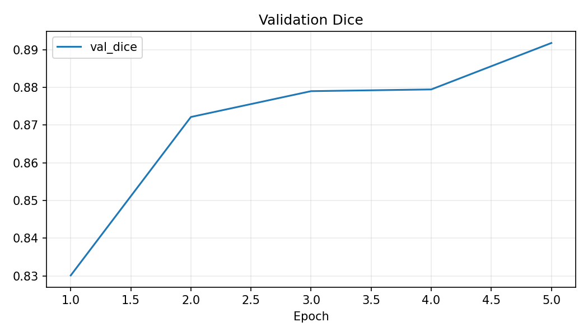
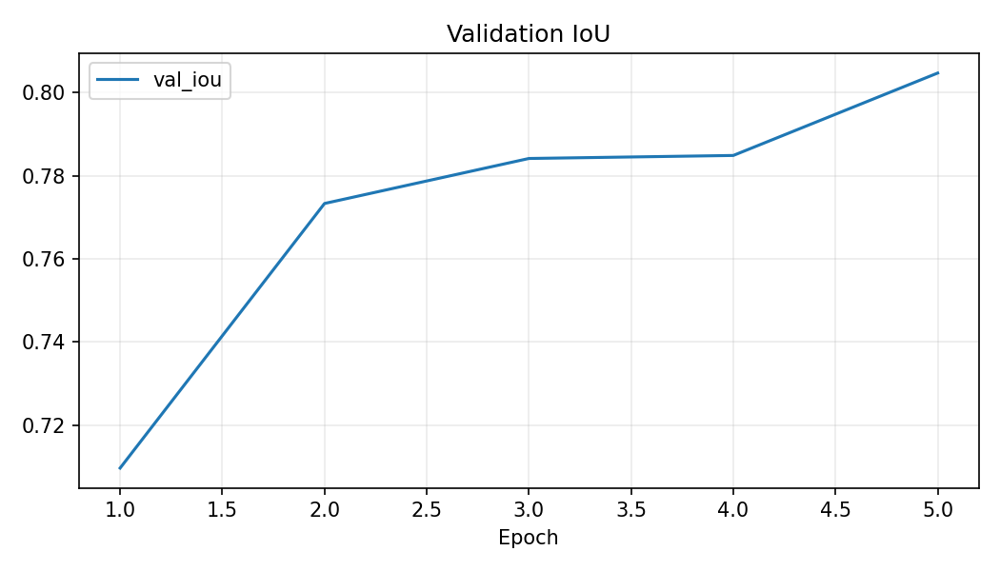
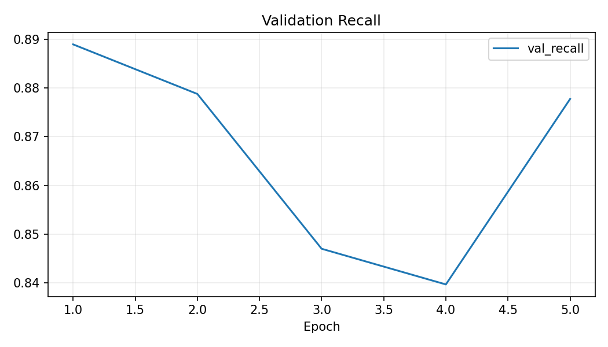

# 🧠 Xây dựng hệ thống phân đoạn tự động khối u não trên ảnh cộng hưởng từ sử dụng mạng U-Net

<p align="center">
  <strong>Đồ án sử dụng PyTorch, U-Net 2D và bộ dữ liệu BraTS 2021</strong><br>
  Phân đoạn vùng u toàn phần (whole tumor) trên ảnh MRI FLAIR
</p>

<p align="center">
  
  
  
  
  
</p>

<p align="center">
  
</p>

---

## 📋 Mục lục

- [1. Giới thiệu đề tài](#1-giới-thiệu-đề-tài)
- [2. Tại sao cần phân đoạn khối u não tự động?](#2-tại-sao-cần-phân-đoạn-khối-u-não-tự-động)
- [3. Mô hình IPO](#3-mô-hình-ipo-input--process--output)
- [4. Dữ liệu đầu vào](#4-dữ-liệu-đầu-vào)
- [5. Kiến trúc U-Net](#5-kiến-trúc-u-net)
- [6. Pipeline xử lý](#6-pipeline-xử-lý)
- [7. Kết quả huấn luyện](#7-kết-quả-huấn-luyện)
- [8. Ứng dụng Streamlit](#8-ứng-dụng-streamlit)
- [9. Cấu trúc thư mục](#9-cấu-trúc-thư-mục)
- [10. Hướng dẫn cài đặt và chạy](#10-hướng-dẫn-cài-đặt-và-chạy)
- [11. Hạn chế và hướng phát triển](#11-hạn-chế-và-hướng-phát-triển)
- [12. Tài liệu tham khảo](#12-tài-liệu-tham-khảo)

---

## 1. Giới thiệu đề tài

### Bối cảnh

U não là một trong những bệnh lý nguy hiểm nhất, đòi hỏi phát hiện và đánh giá chính xác để lập kế hoạch điều trị. Chụp cộng hưởng từ (**MRI - Magnetic Resonance Imaging**) là phương pháp hình ảnh chủ yếu để quan sát cấu trúc não và phát hiện tổn thương. Tuy nhiên, việc khoanh vùng (phân đoạn) khối u trên ảnh MRI bằng tay rất tốn thời gian và phụ thuộc vào kinh nghiệm chủ quan của người đọc ảnh.

### Mục tiêu

Dự án xây dựng một hệ thống **phân đoạn tự động** vùng u toàn phần trên ảnh MRI não, sử dụng mạng **U-Net 2D**, bao gồm:

- ✅ Huấn luyện mô hình trên **1.251 bệnh nhân** từ bộ dữ liệu BraTS 2021
- ✅ Đạt **Dice Score = 0.867** trên tập test (189 bệnh nhân)
- ✅ Tính **diện tích** (cm²) và **thể tích** (cm³) vùng u dự đoán
- ✅ Cung cấp **ứng dụng web Streamlit** để demo trực quan

### Phạm vi

| Hạng mục | Chi tiết |
|---|---|
| Đầu vào | Ảnh MRI FLAIR 3D (NIfTI) |
| Mô hình | U-Net 2D (tự cài đặt) |
| Đầu ra | Mặt nạ nhị phân whole tumor |
| Dữ liệu | BraTS 2021 Task 1 (1.251 bệnh nhân) |
| Framework | PyTorch |
| Giao diện | Streamlit |

---

## 2. Tại sao cần phân đoạn khối u não tự động?

### Mắt thường nhìn thấy u — nhưng đó không phải toàn bộ vấn đề

Trên ảnh MRI, khối u **có thể nhìn thấy** bằng mắt. Tuy nhiên, **"nhìn thấy"** và **"phân đoạn chính xác từng pixel"** là hai việc hoàn toàn khác nhau:

#### 🔍 Ranh giới u mờ dần

Khối u không có đường viền rõ ràng. Vùng u lõi, phù nề và mô não lành chuyển tiếp mờ dần vào nhau → bác sĩ phải quyết định từng pixel thuộc u hay không, rất chủ quan.

#### 🧠 Khối lượng công việc khổng lồ

| Yếu tố | Con số |
|---|---|
| Số lát cắt / bệnh nhân | ~155 lát |
| Tổng pixel / bệnh nhân | **~8,9 triệu voxel** |
| Thời gian bác sĩ vẽ tay | **20–60 phút / bệnh nhân** |
| Thời gian AI phân đoạn | **~30 giây / bệnh nhân** |

#### ⚠️ Sai số chủ quan

Bác sĩ khác nhau vẽ ranh giới u khác nhau. Nghiên cứu cho thấy sai số giữa các chuyên gia (**inter-observer variability**) có thể lên tới 20–30% ở vùng ranh giới.

#### 📏 Cần đo đạc định lượng

Mắt thường **không thể** tính diện tích (cm²), thể tích (cm³) hay so sánh sự thay đổi kích thước u giữa các lần chụp.

### So sánh: Bác sĩ vs AI

| | Bác sĩ (thủ công) | AI (tự động) |
|---|---|---|
| Thời gian | 20–60 phút/ca | ~30 giây/ca |
| Tính nhất quán | Thay đổi theo người đọc | Luôn cho kết quả giống nhau |
| Đo lường | Ước lượng | Tính tự động, chính xác |
| Xử lý số lượng lớn | Không khả thi | Có thể chạy hàng trăm ca |

> 💡 **AI không thay thế bác sĩ**, mà đóng vai trò **công cụ hỗ trợ** — giúp bác sĩ có bản phân đoạn sơ bộ để hiệu chỉnh.

---

## 3. Mô hình IPO (Input – Process – Output)



| Thành phần | Chi tiết |
|---|---|
| **Input** | Ảnh MRI FLAIR 3D (NIfTI), bộ dữ liệu BraTS 2021, nhãn ground-truth do bác sĩ vẽ |
| **Process** | Tiền xử lý (z-score, tách lát 2D) → Huấn luyện U-Net (BCE+Dice) → Suy luận (threshold 0.45, lọc nhiễu) |
| **Output** | Mặt nạ phân đoạn 3D, chỉ số đánh giá (Dice/IoU), diện tích & thể tích u, ứng dụng web Streamlit |

---

## 4. Dữ liệu đầu vào

### 4.1 MRI não và chuỗi xung FLAIR

**MRI** (Chụp cộng hưởng từ) tạo ra khối ảnh 3D gồm nhiều lát cắt xếp chồng (240 × 240 × 155 voxel). Trong đó, chuỗi xung **FLAIR** (Fluid Attenuated Inversion Recovery) triệt tiêu tín hiệu dịch não tủy, giúp vùng u và phù nề **sáng rõ** nhất.

| Chuỗi xung | Đặc điểm | Dự án sử dụng? |
|---|---|---|
| **FLAIR** | Triệt tiêu nước não → u sáng rõ | ⭐ **Có** |
| T1 | Hiển thị cấu trúc giải phẫu | Không |
| T1ce | Sau tiêm thuốc tương phản | Không |
| T2 | Nước và phù nề sáng | Không |

<p align="center">
  
</p>

### 4.2 Định dạng NIfTI (.nii.gz)

**NIfTI** là định dạng chuẩn quốc tế cho ảnh y khoa 3D, chứa:
- **Ma trận voxel 3D** (240×240×155 giá trị số thực)
- **Spacing** (kích thước thật: 1mm × 1mm × 1mm / voxel)
- **Affine matrix** (hệ tọa độ không gian)

→ Nhờ spacing mà hệ thống tính được diện tích (cm²) và thể tích (cm³) thực tế.

<p align="center">
  
</p>

### 4.3 Bộ dữ liệu BraTS 2021

| Thông tin | Chi tiết |
|---|---|
| **Nguồn** | RSNA-ASNR-MICCAI BraTS 2021 Challenge |
| **Tổng bệnh nhân** | 1.251 |
| **Nhãn** | Do bác sĩ chuyên khoa thần kinh vẽ tay |
| **Cấu trúc mỗi bệnh nhân** | 5 file NIfTI (FLAIR, T1, T1ce, T2, SEG) |

**Cấu trúc thư mục 1 bệnh nhân:**

```
BraTS2021_00000/
├── BraTS2021_00000_flair.nii.gz   ← ⭐ INPUT cho model
├── BraTS2021_00000_t1.nii.gz
├── BraTS2021_00000_t1ce.nii.gz
├── BraTS2021_00000_t2.nii.gz
└── BraTS2021_00000_seg.nii.gz     ← 🏷️ NHÃN (đáp án)
```

**Chuyển nhãn sang nhị phân:**

| Nhãn gốc | Ý nghĩa | Nhãn nhị phân |
|---|---|---|
| 0 | Background | 0 (không phải u) |
| 1 | Lõi u hoại tử | **1 (là u)** |
| 2 | Phù nề quanh u | **1 (là u)** |
| 4 | U tăng quang | **1 (là u)** |

**Chia dữ liệu (patient-level split):**

```
1.251 bệnh nhân
├── 875 (70%) → TRAIN (huấn luyện model)
├── 187 (15%) → VALIDATION (chọn threshold, checkpoint)
└── 189 (15%) → TEST (đánh giá cuối cùng)
```

> Chia ở **cấp bệnh nhân** trước khi tạo lát cắt → các lát của cùng một bệnh nhân không bao giờ xuất hiện ở cả train lẫn test.

---

## 5. Kiến trúc U-Net

### 5.1 U-Net là gì?

U-Net là kiến trúc mạng nơ-ron tích chập (CNN) thiết kế **chuyên biệt cho phân đoạn ảnh y khoa** (Ronneberger et al., MICCAI 2015). Cái tên "U-Net" xuất phát từ hình dạng chữ U của kiến trúc.

### 5.2 Kiến trúc chi tiết

```
Input 240×240×1                                      Output 240×240×1
      │                                                      ▲
      ▼                                                      │
┌──────────┐  skip connection  ┌──────────┐
│ Encoder  │ ─────────────────►│ Decoder  │    Khôi phục chi tiết
│ 240×240  │                   │ 240×240  │    không gian (biên u)
└────┬─────┘                   └─────▲────┘
     │                               │
┌────▼─────┐  skip connection  ┌─────┴────┐
│ Encoder  │ ─────────────────►│ Decoder  │
│ 120×120  │                   │ 120×120  │
└────┬─────┘                   └─────▲────┘
     │                               │
┌────▼─────┐  skip connection  ┌─────┴────┐
│ Encoder  │ ─────────────────►│ Decoder  │
│  60×60   │                   │  60×60   │
└────┬─────┘                   └─────▲────┘
     │                               │
┌────▼─────┐  skip connection  ┌─────┴────┐
│ Encoder  │ ─────────────────►│ Decoder  │
│  30×30   │                   │  30×30   │
└────┬─────┘                   └─────▲────┘
     │                               │
     └──────────┐ Bottleneck ┌───────┘
                │   15×15    │
                └────────────┘
```

### 5.3 Vai trò từng thành phần

| Thành phần | Vai trò |
|---|---|
| **Encoder (nhánh co)** | Trích xuất đặc trưng, trả lời *"đây có phải vùng u không?"* |
| **Bottleneck** | Nắm bắt ngữ cảnh toàn cục: vị trí, kích thước, hình dạng u |
| **Decoder (nhánh giãn)** | Khôi phục chi tiết, trả lời *"ranh giới u chính xác ở đâu?"* |
| **Skip connections** | Truyền thông tin biên, cạnh từ encoder → decoder → **đường viền u sắc nét** |

### 5.4 Tại sao chọn U-Net?

1. **Thiết kế cho ảnh y khoa** — hoạt động tốt ngay cả khi dữ liệu không quá lớn
2. **Skip connections** — giữ lại chi tiết biên vùng u
3. **Phân loại từng pixel** — mỗi pixel được đánh giá riêng (u/nền)
4. **Đã được chứng minh** — hàng nghìn nghiên cứu y khoa sử dụng

### 5.5 Cấu hình model

```yaml
model:
  name: unet
  in_channels: 1        # 1 kênh (FLAIR grayscale)
  out_channels: 1        # 1 kênh (nhị phân: u/nền)
  base_channels: 16      # Kênh đặc trưng cơ sở
  bilinear: true          # Bilinear upsampling
```

---

## 6. Pipeline xử lý

### 6.1 Kiến trúc tổng thể

```mermaid
flowchart LR
    subgraph S1["1. Nguồn dữ liệu"]
        A1["BraTS 2021<br/>NIfTI archive"]
    end

    subgraph S2["2. Chuẩn bị"]
        B1["Giải nén"]
        B2["Kiểm tra dữ liệu"]
        B3["Chia train/val/test"]
    end

    subgraph S3["3. Tiền xử lý"]
        C1["Z-score normalize"]
        C2["Tách lát axial 2D"]
        C3["Resize 240×240"]
        C4["Augmentation"]
    end

    subgraph S4["4. Huấn luyện"]
        D1["U-Net 2D"]
        D2["BCE + Dice loss"]
        D3["AdamW optimizer"]
        D4["Early stopping"]
    end

    subgraph S5["5. Đánh giá"]
        E1["Chọn threshold<br/>trên validation"]
        E2["Test evaluation<br/>189 bệnh nhân"]
    end

    subgraph S6["6. Ứng dụng"]
        F1["Streamlit web app"]
        F2["Dự đoán mask 3D"]
        F3["Tính diện tích,<br/>thể tích"]
    end

    A1 --> B1 --> B2 --> B3
    B3 --> C1 --> C2 --> C3 --> C4
    C4 --> D1 --> D2 --> D3 --> D4
    D4 --> E1 --> E2
    D4 --> F1
    E2 --> F2 --> F3
```



### 6.2 Tiền xử lý

| Bước | Mô tả |
|---|---|
| **Z-score normalization** | `(x - mean) / std` trên vùng não ≠ 0. Chuẩn hóa cường độ giữa các bệnh nhân |
| **Tách lát axial** | Thể tích 3D → 155 lát cắt 2D (240×240) |
| **Resize** | Đưa về kích thước 240×240 nếu cần |
| **Augmentation** (chỉ train) | Lật ngang, thay đổi cường độ, thêm Gaussian noise |

### 6.3 Huấn luyện

| Tham số | Giá trị |
|---|---|
| **Hàm loss** | 0.5 × BCEWithLogitsLoss + 0.5 × Soft Dice Loss |
| **Optimizer** | AdamW (lr=1e-4, weight_decay=1e-5) |
| **Scheduler** | ReduceLROnPlateau (theo val_dice) |
| **Epochs** | 5 |
| **Batch size** | 32 |
| **Mixed precision** | Bật (AMP) |
| **Early stopping** | Patience = 2 |
| **GPU** | Tesla T4 (Kaggle) |

### 6.4 Suy luận và hậu xử lý

```
Ảnh FLAIR 3D → Z-score → Tách lát → U-Net → Sigmoid → Threshold ≥ 0.45
                                                            ↓
                              Tái tạo mask 3D ← Lọc component nhỏ (<20px)
                                    ↓
                        Tính diện tích + thể tích → Xuất NIfTI
```

### 6.5 Tính diện tích và thể tích

**Diện tích trên lát cắt z:**
```
area_mm² = số_pixel_dương × spacing_x × spacing_y
area_cm² = area_mm² / 100
```

**Thể tích toàn bộ khối u:**
```
voxel_volume_mm³ = spacing_x × spacing_y × spacing_z
tumor_volume_mm³ = số_voxel_dương × voxel_volume_mm³
tumor_volume_cm³ = tumor_volume_mm³ / 1000
```

---

## 7. Kết quả huấn luyện

### 7.1 Kết quả trên Test Set (189 bệnh nhân)

| Metric | Giá trị | Ý nghĩa |
|---|---|---|
| **Dice** | **0.8668** | 86,7% trùng khớp giữa dự đoán và nhãn thật |
| **IoU** | **0.7830** | Tỉ lệ giao / hội |
| **Precision** | **0.8962** | 89,6% pixel AI đánh dấu là u → đúng là u |
| **Recall** | **0.8633** | 86,3% pixel thực sự là u → AI phát hiện được |
| **Specificity** | **0.9989** | 99,9% pixel bình thường → AI nhận đúng là bình thường |
| **Threshold** | **0.45** | Ngưỡng tối ưu (chọn trên validation set) |

### 7.2 Quá trình huấn luyện

**Lịch sử huấn luyện qua 5 epoch:**

| Epoch | Train Loss | Val Loss | Val Dice | Val IoU | Val Precision | Val Recall |
|---|---|---|---|---|---|---|
| 1 | 0.5889 | 0.4686 | 0.8301 | 0.7096 | 0.7786 | 0.8890 |
| 2 | 0.3365 | 0.3501 | 0.8722 | 0.7733 | 0.8656 | 0.8788 |
| 3 | 0.2571 | 0.3190 | 0.8790 | 0.7841 | 0.9135 | 0.8470 |
| 4 | 0.1312 | 0.0841 | 0.8795 | 0.7849 | 0.9232 | 0.8396 |
| 5 | 0.0970 | 0.0718 | **0.8918** | **0.8047** | 0.9063 | 0.8778 |

### 7.3 Biểu đồ huấn luyện

**Biểu đồ Loss:**

<p align="center">
  
</p>

> Loss giảm liên tục qua 5 epoch, train loss và val loss đều giảm → model đang học tốt, chưa overfit.

**Biểu đồ Validation Dice:**

<p align="center">
  
</p>

> Dice tăng từ 0.83 (epoch 1) lên 0.89 (epoch 5), cho thấy model cải thiện liên tục qua mỗi epoch.

**Biểu đồ IoU và Recall:**

<p align="center">
  
  
</p>

### 7.4 Tìm threshold tối ưu

Threshold được tìm **chỉ trên validation set** (187 bệnh nhân):

| Threshold | Mean Dice |
|---|---|
| 0.30 | 0.8676 |
| 0.35 | 0.8677 |
| 0.40 | 0.8678 |
| **0.45** | **0.8679** ← tốt nhất |
| 0.50 | 0.8679 |
| 0.55 | 0.8678 |
| 0.60 | 0.8677 |

### 7.5 Trực quan hóa kết quả phân đoạn trên ảnh MRI thực tế

<p align="center">
  
</p>

- **Lát cắt u lớn (Slice 74):** Mô hình đạt Dice **0.912**, đường viền phân đoạn bao bọc chính xác toàn bộ vùng lõi u và phù nề quanh u.
- **Lát cắt u trung bình (Slice 62):** Mô hình định vị chính xác vị trí khối u trung tâm, độ nhạy cao và đường bao sát với nhãn của bác sĩ.
- **Lát cắt não bình thường (Slice 35):** Mô hình dự đoán **0 pixel u** (Dice 1.000), chứng minh khả năng kháng báo động giả (không bị False Positive) trên các vùng mô não lành.
- **Quy ước màu đối chiếu trên ảnh Chồng lấp (Overlay):**
  - 🟩 **Màu xanh lá (True Positive):** Vùng U-Net dự đoán trùng khớp hoàn toàn với bác sĩ gán nhãn.
  - 🟥 **Màu đỏ (False Positive):** Vùng U-Net dự đoán thừa ngoài nhãn bác sĩ.
  - 🟦 **Màu xanh dương (False Negative):** Vùng nhãn bác sĩ mà mô hình bỏ sót.

---

## 8. Ứng dụng Streamlit

### 8.1 Giao diện

Ứng dụng web cho phép:

- 📤 **Upload** file MRI FLAIR (.nii / .nii.gz)
- 🔍 **Tự động phân đoạn** toàn bộ thể tích MRI
- 📊 **Hiển thị kết quả**: có/không phát hiện vùng u, số voxel, thể tích (cm³), xác suất trung bình
- 🖼️ **Trực quan**: Ảnh MRI gốc, mask AI dự đoán, overlay (ảnh MRI phủ mask đỏ)
- 🎚️ **Thanh trượt**: Xem từng lát cắt axial
- 💾 **Tải về**: Mặt nạ NIfTI dự đoán

### 8.2 Các thành phần hiển thị

| Thành phần | Mô tả |
|---|---|
| **Suspicious tumor-like region** | Detected / Not Detected |
| **Predicted tumor voxels** | Tổng số voxel được đánh dấu là u |
| **Estimated tumor volume** | Thể tích u ước tính (cm³) |
| **Mean lesion probability** | Xác suất trung bình trong vùng dự đoán |
| **Original FLAIR** | Ảnh MRI gốc |
| **AI predicted mask** | Mặt nạ nhị phân (trắng = u, đen = bình thường) |
| **FLAIR + prediction overlay** | Ảnh gốc phủ vùng đỏ = vị trí u |

### 8.3 Khởi chạy

```bash
streamlit run app/app.py
```

Mở trình duyệt tại `http://localhost:8501` → Upload file `_flair.nii.gz` từ `data/extracted/` để test.

---

## 9. Cấu trúc thư mục

```
brain-tumor-mri-unet/
├── app/
│   └── app.py                     # 🌐 Giao diện Streamlit
├── configs/
│   ├── config.yaml                # Cấu hình thí nghiệm
│   └── kaggle_fast.yaml           # Cấu hình Kaggle GPU
├── data/
│   ├── extracted/                 # Thư mục bệnh nhân (NIfTI)
│   ├── metadata/                  # dataset_metadata.csv
│   └── splits/                    # train.txt, val.txt, test.txt
├── debug/
│   └── overfit_small_batch.py     # Sanity-check
├── docs/
│   └── images/                    # Ảnh cho README
├── models/
│   ├── best_model.pt              # ⭐ Checkpoint tốt nhất
│   └── last_model.pt              # Checkpoint cuối
├── notebooks/
│   ├── 01_eda.ipynb               # Khám phá dữ liệu
│   ├── 02_error_analysis.ipynb    # Phân tích ca Dice thấp
│   └── 03_staged_kaggle.ipynb     # Notebook Kaggle staged
├── outputs/
│   ├── evaluation/                # summary.json, per_patient.csv
│   ├── figures/                   # Biểu đồ loss, dice, iou
│   ├── logs/                      # Training history
│   └── predictions/               # NIfTI dự đoán
├── scripts/
│   ├── create_kaggle_bundle.py    # Tạo ZIP cho Kaggle
│   ├── create_splits.py           # Chia bệnh nhân
│   ├── download_dataset.py        # Tải dataset
│   ├── find_best_threshold.py     # Tìm threshold tối ưu
│   ├── finish_project.py          # Hoàn tất pipeline
│   ├── prepare_dataset.py         # Giải nén, tạo metadata
│   └── validate_dataset.py        # Kiểm tra dataset
├── src/
│   ├── data/                      # NIfTI, preprocessing, dataset
│   ├── evaluation/                # Metric, test evaluation
│   ├── inference/                 # Predict, post-processing
│   ├── models/
│   │   └── unet.py                # 🧠 Kiến trúc U-Net
│   ├── training/                  # Loss, trainer
│   ├── utils/                     # Config, device, seed
│   └── visualization/             # Ảnh overlay
├── tests/                         # 25 unit/integration tests
├── requirements.txt
├── pytest.ini
├── LICENSE
└── README.md                      # 📖 File này
```

---

## 10. Hướng dẫn cài đặt và chạy

### 10.1 Yêu cầu

- Python 3.10+
- GPU (khuyến nghị, nhưng CPU cũng chạy được với Streamlit inference)

### 10.2 Cài đặt

```bash
# Clone repository
git clone <repository-url>
cd brain-tumor-mri-unet

# Tạo virtual environment
python -m venv .venv

# Kích hoạt (Windows PowerShell)
.venv\Scripts\Activate.ps1

# Cài thư viện
pip install -r requirements.txt
```

### 10.3 Chạy ứng dụng Streamlit (demo)

```bash
streamlit run app/app.py
```

Yêu cầu: `models/best_model.pt` phải tồn tại (đã huấn luyện xong).

### 10.4 Pipeline đầy đủ (nếu muốn train lại)

```bash
# 1. Tải dữ liệu BraTS 2021
python scripts/download_dataset.py

# 2. Giải nén và tạo metadata
python scripts/prepare_dataset.py --config configs/config.yaml

# 3. Chia dữ liệu
python scripts/create_splits.py --config configs/config.yaml

# 4. Huấn luyện (cần GPU)
python -m src.training.train --config configs/config.yaml

# 5. Tìm threshold tối ưu
python scripts/find_best_threshold.py --config configs/config.yaml --checkpoint models/best_model.pt

# 6. Đánh giá test set
python -m src.evaluation.evaluate --config configs/config.yaml --checkpoint models/best_model.pt

# 7. Chạy web
streamlit run app/app.py
```

### 10.5 Kiểm thử

```bash
pytest -q
# 25 tests passed ✅
```

---

## 11. Hạn chế và hướng phát triển

### Hạn chế

| # | Hạn chế |
|---|---|
| 1 | Dữ liệu BraTS không đại diện cho mọi bệnh viện và máy chụp |
| 2 | Chỉ dùng 1 chuỗi xung FLAIR, bỏ qua T1, T1ce, T2 |
| 3 | U-Net 2D không mô hình hóa ngữ cảnh giữa các lát cắt |
| 4 | Chưa có external validation hoặc clinical validation |
| 5 | Threshold cố định có thể bỏ sót tổn thương nhỏ |
| 6 | Chỉ 5 epoch — có thể cải thiện thêm với nhiều epoch hơn |

### Hướng phát triển

- 🔬 So sánh FLAIR-only với đầu vào 4 modality
- 🏗️ So sánh U-Net 2D với U-Net 3D
- 🎯 Mở rộng từ whole-tumor sang các subregion (lõi u, phù nề, u tăng quang)
- 📊 Bổ sung uncertainty estimation
- 🏥 Thực hiện external validation trên dữ liệu từ bệnh viện khác
- 🚀 Khảo sát kiến trúc nâng cao: Attention U-Net, U-Net++, UNETR

---

## 12. Tài liệu tham khảo

1. U. Baid et al., "The RSNA-ASNR-MICCAI BraTS 2021 Benchmark on Brain Tumor Segmentation and Radiogenomic Classification," 2021. [arXiv:2107.02314](https://arxiv.org/abs/2107.02314)

2. O. Ronneberger, P. Fischer, T. Brox, "U-Net: Convolutional Networks for Biomedical Image Segmentation," MICCAI 2015. [arXiv:1505.04597](https://arxiv.org/abs/1505.04597)

3. BraTS 2021, Center for Biomedical Image Computing & Analytics, University of Pennsylvania. [https://www.med.upenn.edu/cbica/brats2021/](https://www.med.upenn.edu/cbica/brats2021/)

---

## Giấy phép

Mã nguồn tuân theo giấy phép trong [LICENSE](LICENSE). Dữ liệu BraTS có điều khoản sử dụng riêng; người dùng phải tuân thủ giấy phép và quy định của nguồn dữ liệu.

